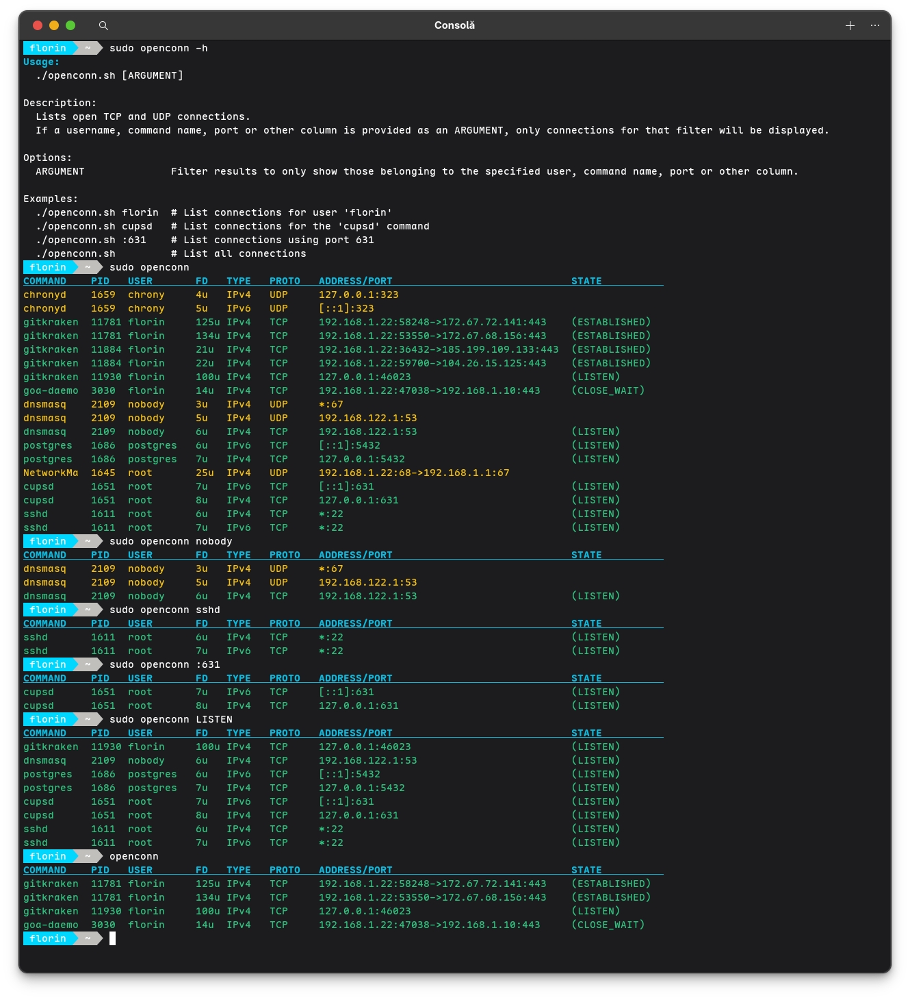

# $\textcolor{cyan}{\textbf {Utils}}$
In this area there are useful scripts and wrappers.  
## $\textcolor{cyan}{openconn}$
Is a wrapper to 'lsof -Pni{4,6}{TCP,UDP}' for show open connections.  

## $\textcolor{teal}{License}$

This project is licensed under the GNU GENERAL PUBLIC LICENSE - see the [LICENSE](LICENSE) file for details

## $\textcolor{red}{Warning}$

Thees open-source pieces of software is distributed in the hope that it will be useful, but **WITHOUT ANY WARRANTY**.  
A very good idea is to test first into virtual machine.

I will back soon with more info...
# Work is in progress...